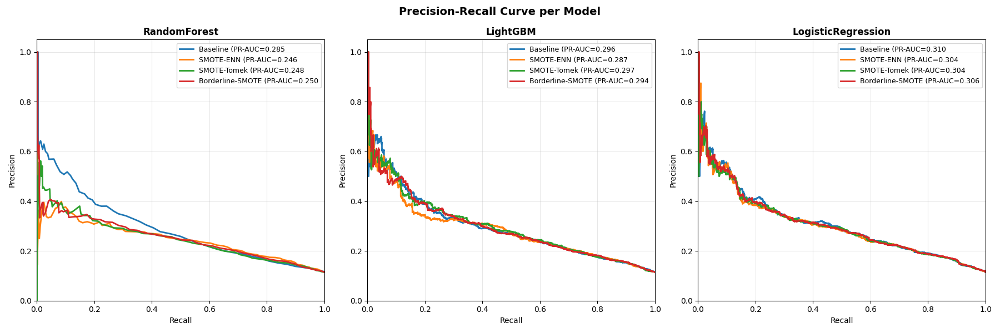
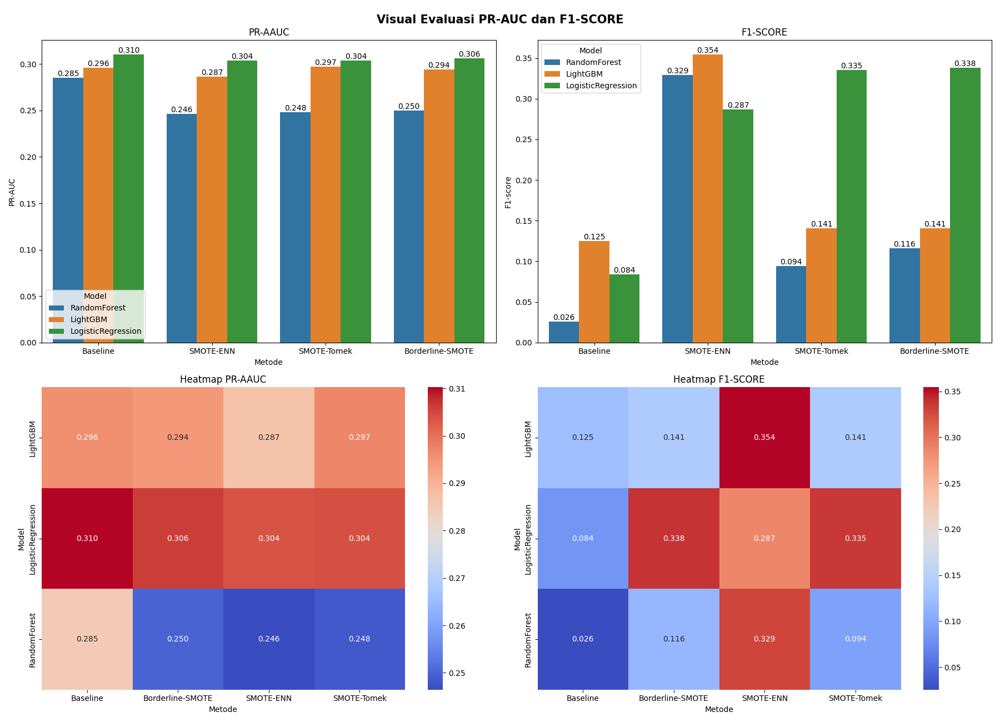

# Loan Default Prediction — Imbalanced Classification

## Project Overview

Project ini bertujuan untuk memprediksi kemungkinan **loan default** menggunakan beberapa model machine learning dengan fokus utama pada **penanganan data imbalance**.

Dataset yang digunakan memiliki distribusi kelas yang tidak seimbang, sehingga evaluasi model dilakukan menggunakan metrik yang lebih relevan seperti:

* **PR-AUC (Precision-Recall AUC)**
* **F1-Score**
* **Recall**
* **Precision**
* serta analisis tambahan melalui **Classification Report** dan **Confusion Matrix**

---

## Dataset

Dataset diambil dari Kaggle:

link : https://www.kaggle.com/datasets/nikhil1e9/loan-default

---

## Methods & Models

### 🔹 Models yang digunakan:

* Logistic Regression
* Random Forest
* LightGBM

### 🔹 Teknik Imbalance Handling:

* Baseline (tanpa handling)
* SMOTE-ENN (hybrid)
* SMOTE-Tomek (hybrid)
* Borderline-SMOTE

---

## Evaluation Metrics

Karena dataset imbalance, metrik yang digunakan:

* **PR-AUC** → mengukur kemampuan model dalam menangkap kelas minoritas
* **F1-Score** → keseimbangan precision dan recall

---

## Visualization Results

### 🔹 Precision-Recall Curve

**Insight:**

* Logistic Regression memberikan performa paling stabil di seluruh range recall
* Random Forest mengalami penurunan precision yang signifikan
* Teknik resampling tidak selalu meningkatkan performa (terlihat pada Random Forest)

---

### 🔹 Bar Plot & Heatmap Evaluation

**Insight:**

#### PR-AUC:

* Logistic Regression consistently terbaik (~0.30)
* LightGBM cukup stabil (~0.29)
* Random Forest paling rendah (~0.25–0.28)

#### F1-Score:

* SMOTE-based methods meningkatkan F1 secara signifikan
* LightGBM + SMOTE-ENN menghasilkan F1 tertinggi (~0.35)
* Logistic Regression juga menunjukkan peningkatan besar dengan resampling

---

## Cross Validation Results

| Model              | Method           | PR-AUC | PR-AUC_std | F1    | F1_std |
| ------------------ | ---------------- | ------ | ---------- | ----- | ------ |
| LogisticRegression | Baseline         | 0.305  | 0.013      | 0.060 | 0.013  |
| LogisticRegression | Borderline-SMOTE | 0.304  | 0.007      | 0.337 | 0.007  |
| LogisticRegression | SMOTE-Tomek      | 0.301  | 0.010      | 0.330 | 0.010  |
| LogisticRegression | SMOTE-ENN        | 0.299  | 0.004      | 0.283 | 0.004  |
| LightGBM           | SMOTE-ENN        | 0.292  | 0.013      | 0.346 | 0.013  |
| LightGBM           | Baseline         | 0.291  | 0.014      | 0.121 | 0.014  |
| RandomForest       | Baseline         | 0.281  | 0.008      | 0.035 | 0.008  |

---

## Key Findings

### 1. Logistic Regression surprisingly strong

* Memberikan **PR-AUC terbaik dan stabil**
* Menunjukkan bahwa hubungan linear cukup kuat di dataset ini

---

### 2. Resampling impact besar ke F1, tapi kecil ke PR-AUC

* F1-score naik drastis setelah SMOTE
* Tapi PR-AUC hampir tidak berubah signifikan

Artinya:

> Model jadi lebih "berani" prediksi kelas minoritas, tapi ranking probabilitas tidak banyak berubah

---

### 3. Random Forest underperform

* PR-AUC paling rendah
* Sensitif terhadap imbalance meskipun sudah di-resample

---

### 4. LightGBM best trade-off

* Tidak terbaik di PR-AUC
* Tapi terbaik di F1-score (SMOTE-ENN)

Cocok jika:

> tujuan adalah menangkap sebanyak mungkin default (recall tinggi)

---

## Conclusion

* Logistic Regression → **best overall (PR-AUC & stability)**
* LightGBM + SMOTEENN → **best F1-score (recall oriented)**
* Random Forest → kurang cocok untuk kasus ini

---

## Future Improvements

Beberapa peningkatan yang dapat dilakukan:

### 🔹 1. Feature Engineering

* Debt-to-income ratio
* Loan-to-income ratio
* Interaction features

---

### 🔹 2. Threshold Optimization

* Tidak menggunakan default threshold (0.5)
* Optimasi berdasarkan F1 / Recall

---

### 🔹 3. Hyperparameter Tuning

* Fokus pada LightGBM & Random Forest
* Gunakan RandomizedSearch / Bayesian Optimization
